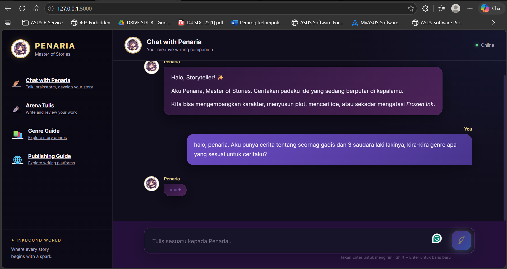
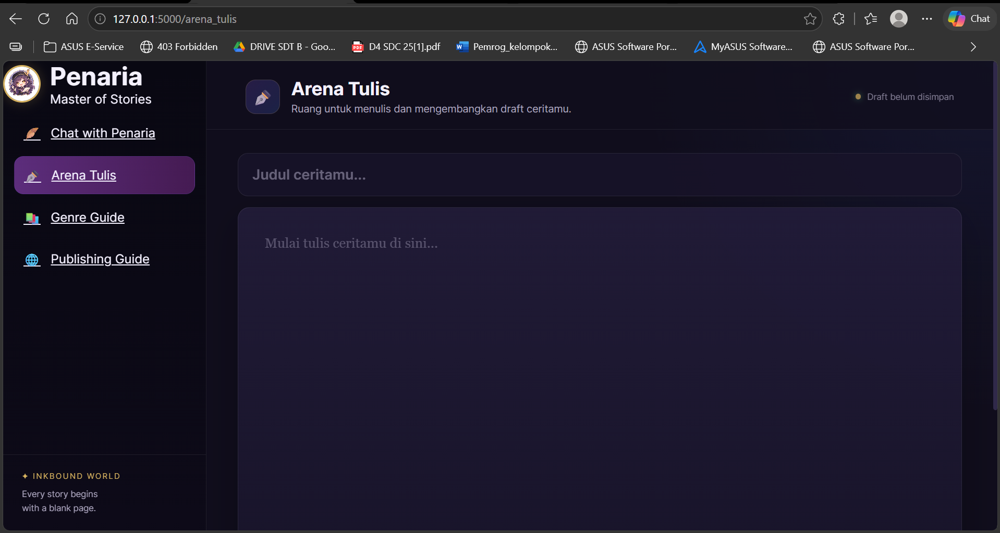
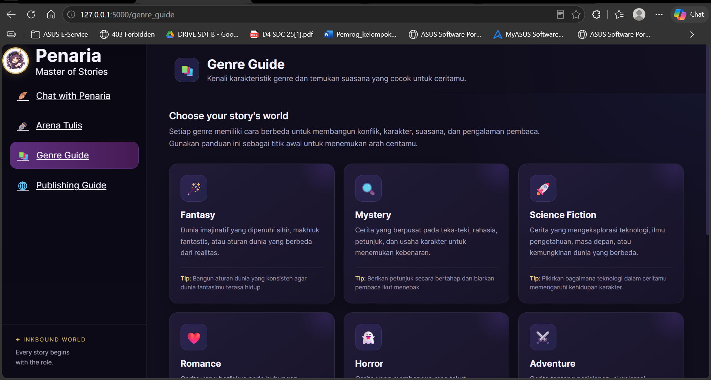
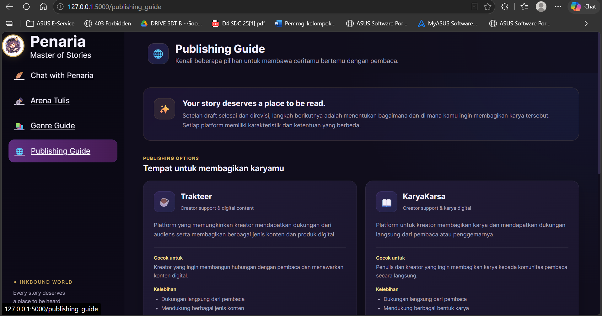

# Penaria — Creative Writing Companion

Penaria adalah chatbot berbasis Large Language Model (LLM) yang dirancang sebagai
teman dan pendamping dalam proses creative writing.

Penaria membantu pengguna dalam mengembangkan ide cerita, karakter, plot,
dialog, serta memberikan feedback terhadap tulisan. Penaria tidak menulis
seluruh cerita untuk pengguna, tetapi membantu pengguna menemukan dan
mengembangkan ide mereka sendiri.


---

## 1. Tema dan Konsep Chatbot

### Tema Chatbot : Asisten Penulis Pemula

### Nama Chatbot

**Penaria — Creative Writing Companion**

### Konsep

Penaria merupakan chatbot dengan karakter fiksi bernama Penaria, seorang
"Master of Stories" dari dunia fiksi bernama **Inkbound World**.

Dalam aplikasi ini, Penaria berperan sebagai creative writing companion.
Pengguna dapat berdiskusi dengan Penaria mengenai berbagai aspek penulisan,
seperti:

- brainstorming ide cerita
- pengembangan karakter
- pengembangan plot
- pembuatan dan pengembangan konflik
- pengembangan dialog
- mencari ide ketika mengalami writer's block
- memberikan feedback terhadap draft
- mendiskusikan genre cerita
- mendapatkan referensi mengenai publikasi karya

Penaria memiliki kepribadian yang ramah, sabar, kritis, dan
solution-oriented. Bahasa utama yang digunakan adalah Bahasa Indonesia.

### Fitur Utama

Aplikasi Penaria terdiri dari beberapa bagian utama:

#### 1. Chat with Penaria

Halaman utama untuk berdiskusi langsung dengan Penaria.

Pengguna dapat mengirim pertanyaan atau ide dan Penaria akan merespons
berdasarkan system prompt serta conversation history.

#### 2. Arena Tulis

Arena Tulis merupakan ruang untuk menulis dan menyimpan draft cerita.

Fitur yang tersedia:

- judul draft
- text editor
- penghitung jumlah kata
- penghitung jumlah karakter
- penyimpanan draft menggunakan browser localStorage

Arena Tulis berfokus pada proses menulis, sedangkan diskusi dan brainstorming
dengan AI dilakukan melalui halaman Chat with Penaria.

#### 3. Genre Guide

Halaman referensi genre yang memberikan penjelasan singkat mengenai beberapa
genre cerita:

- Fantasy
- Mystery
- Science Fiction
- Romance
- Horror
- Adventure
- Slice of Life
- School
- Comedy

Setiap genre memiliki penjelasan dan tips singkat yang dapat digunakan
sebagai referensi saat mengembangkan cerita.

#### 4. Publishing Guide

Halaman referensi mengenai beberapa pilihan platform untuk membagikan karya
digital.

Platform yang dibahas dalam aplikasi antara lain:

- Trakteer
- KaryaKarsa

Halaman ini juga menyediakan checklist sebelum karya dipublikasikan.

---

# 2. Teknologi yang Digunakan

Project ini menggunakan:

- **Python**
- **Flask** — web framework untuk backend
- **Groq API** — API untuk mengakses Large Language Model
- **OpenAI GPT-OSS 120B** melalui Groq
- **HTML** — struktur halaman web
- **CSS** — tampilan dan layout
- **JavaScript** — interaksi frontend
- **JSON** — penyimpanan conversation history
- **localStorage** — penyimpanan draft pada Arena Tulis
- **python-dotenv** — membaca API key dari file `.env`

---

# 3. Struktur Project

Struktur utama project Penaria adalah sebagai berikut:

```text
Chatbot-Penaria/
│
├── app.py
├── .env
├── .env.example
├── .gitignore
├── requirements.txt
├── README.md
│
├── prompts/
│   └── system_prompt.py
│
├── templates/
│   ├── index.html
│   ├── writing_arena.html
│   ├── genre_guide.html
│   └── publishing_guide.html
│
├── static/
│   ├── css/
│   │   └── style.css
│   │
│   ├── js/
│   │   ├── app.js
│   │   └── writing_arena.js
│   │
│   └── images/
│       └── penaria.png
|       └── penaria_waiting.png
│
└── data/
    └── conversation/
        └── conversation.json
```
### Pemjelasan Strutur File
**app.py**
merupakan file utama dalam projet chatbot-Penaria ini dan menjadi backend Flask berada. 
File ini memiliki beberapa tugas antara lain :
1. Menjalankan Backend Flask
2. Membaca API Groq
3. Membuat koneksi ke Groq
4. Mengelola Conversation history
5. Mengirim request ke LLM
6. Memberikan response kepada Frontend
7. Menyimpan Conversation History ke file json yang berada di folder data/conversation
8. memuat kembali histori ketika aplikasi dijalankan

**Prompts/system_prompt.py**
adalah file yang berisi promt yang akan menentukan role, indentisa, dan tugas dari model LLM, serta batasannya dan gaya komunikasi yang digunakan (LLM) dalam project Chatbot-Penaria
system_prompt dipisahakan dari app.py agar lebih mudah dibaca dan dikembangkan dikemudian hari.

**templates/**
adalah folder yang berisi seluruh file html dalam project, antara lain:

1. index.html : file html yang mengatur tampilan halaman "Chat with Penaria"(halaman chatbot)
2. writing_arena.html : file yang mengatur tampilan halaman "arena tulis", tempat penulis dapat menulisa draf karyanya dan akan disimpan dalam lokal, serta ada opsi tulis judul dan perhitungan jumlah karakter dan kata.
3. genre_guide.html : file yang mengatur tampilan halaman "Genre Guide", berisi overview dari 9 genre dan tips pengembangannya
4. publishing_guide : file yang mengantur tampilan halaman "Publishing Guide", tempat overview lokasi upload karya unntuk pemula **(jumlah web upload karya bisa ditambah)**

**static/css/style.css**
berisi styling dan lanyout dari keseluruhan website Penaria, dengan palet warna utama adalah Ungu, Biru, Hitam, dan Emas.

**static/js/app.js**
Mengatur interaksi halaman "Chat with Penaria", dimana file ini akan bertanggung jawab atas:
1. Pengiriman pesan user <=> Penaria
2. request ke endpoint /chat
3. menampilkan pesan user
4. menampilkan response Penaria
5. typing indikator (icon pena bulu akan memudar dan bergerak halus, akan muncul titik 3 bergerak di percakapan Penaria)
6. auto scroll
7. Pengiriman pesan dengan tombol enter (pindah baris : Shift + Enter)

**static/js/writing_arena.js**
Mengatur interaksi arena tulis, dengan fitur fitur yang dingani sebagai berikut :
1. word counter
2. chracter counter
3. menyimpan draf
4. memuat draf
5. status draf

**static/images/penaria.png**
ilustrasi dari ikon penari. Ikon ini akan digunakan pada sidebar, hearder chat, chat bubble Penaria

**data/conversation/conversation.json**
digunaan untuk menyimapan convbersation history dan membacanya kembali
gambaran isi file:
```text
[
  {
    "role": "user",
    "content": "..."
  },
  {
    "role": "assistant",
    "content": "..."
  }
]
```
## 4. Cara Menjalankan Program ##
**Requirements**
Pastikan suah terinstall:
1. Python 3x
2. pip
3. Git

**Step 1- Clone atau Dowload Reopository-Chatbot-Penaria**
```text
git clone <URL-REPOSITORY
```
Kemudian masuk ke folder project:
``` text
cd Chatbot-Penaria
```
jika project sudah ada di komputer, langsung buka terminal pada folder project tersebut.

**Step 2-Membuat Virtual Environment**
Buat Virtual Environment di windows:
```text
python -m venv venv
```
aktifkan virtual environtment dengan 
```text
venv\Scripts\Activate
```
jika berhasil akan muncul tanda 
```text
(venv)
```
dipojok kiri sebelah path folder pada terminal

***Step 3- Install Dependencies**
```text
ip install -r requirments.txt
```

**Step 4- Membuat API Key**
project ini menggunakan Groq API
buat file 
```text
.env
```
di folder utama project
isinya adalah 
```text
GROQ_API_KEY=MASUKKAN_API_KEY_KAMU_DI_SINI
```
Ganti bagian tersebut dengan API Key milik mu. Jangan sampai API KEy mu di push ke github.
taruh .env mu di .gitignore.

**Step 5- Isi .gitignore**
```text
.env
venv/
.venv/
__pycache__/
*.pyc

data/conversation/conversation.json

*.tmp
```
Hasil conversation juga tidak dipush ke github karena berkemungkinan besar berisi histori percakapan yang pribadi. namun tenang file ini akan otomatis tercipta saat terjadinya percakapan antara Penaria dengan user.
**Step 6- Menjalankan Flask**
beralih ke terminal dan jalankan berikut:
```text
pythonb app.py
```
Jika berhasil, Flask akan menampilkan alamat server, misalnya:
```text
Running on http://127.0.0.1:5000
```
salin link tersebut ke browser kesayangan Anda

## 5. Cara Menggunakan Website Chatbot-Penaria
setelah website berhasil diakses, akan muncul 4 menu utama pada sidebar. Menu pertama dan menjadi halaman utama projek ini akan otomatis terbuka, yaitu Chat with Penaria.

**Chat with Penaria**
digunakan untuk berdiskusi dengan penaria sebagai Assistant Penulis Pemula yang akan memberikan saran, kritik, dan masukan kepada penulis untuk emngembangakan ceritanya.
contoh 
```text
Aku ingin membuat cerita fantasy tentang seorang penyihir muda.
Bantu aku mengembangkan konflik utamanya.
```
Kemudian Penariia akan membantu mengembangkan ide tersebut.

**Arena Tulis**
digunakan sebagai tempat penulis menuliskan draf cerita

pengguna dpaat mengakses beebrapa fitur dari halaman ini, antara lain;
1. Memasukkan judul
2. Menulis cerita
3. Melihat jumlah kata
4. Melihat jumlah karakter
5. Menyimpan draf cerita
Draf akan disimpan pada bowser menggunakan **localstroge**

**Genre Guide**
Digunakan sebagai referensi ketika pengguna ingin memahami karakteristik
suatu genre.

**Publishing Guide**
Digunakan sebagai referensi awal mengenai pilihan platform publikasi karya
digital seperti Trakteer dan KaryaKarsa.

## 6. Conversation History
Penaria menggunakan conversation history agar AI dapat mempertahankan konteks percakapan 
alurnya:
```text
User
  ↓
Frontend JavaScript
  ↓
POST /chat
  ↓
Flask
  ↓
conversation_history
  ↓
Groq API
  ↓
Penaria
  ↓
Response
  ↓
conversation_history
  ↓
conversation.json
```
Ketika website dijalankan
```text
conversation.json
       ↓
load_conversation()
       ↓
conversation_history
       ↓
Groq API
```
denagn demikian, conversation history dapat dimuat kembali setelah website dimatikan dan dijalankan ulang

## 7. Contoh Percakapan dan Screenshot
**1. pecakapan awal dan Loading**



**2. hasil percakapanan**


**3. conversation dalam satu sesi yang sama**


**4. Conversation berbeda sesi**
Saat percakapan pengguna memperkenalkan dirinya sebagai **nana**


user meminta namanya untuk diingat


**Pergantian sesi** (dimatikan dan dihidupkan kembali) User menanyakan namanya kembali)


**Tampilan Arena Tulis**



**Tampilan Genre Guide**



**Tampilan Publishing Guide**



## 8. Arsitektur "Chat with Penaria" Secara Sederhana
```text
                    ┌─────────────────────┐
                    │       User          │
                    └──────────┬──────────┘
                               │
                               ▼
                    ┌─────────────────────┐
                    │   HTML / CSS / JS   │
                    │      Frontend       │
                    └──────────┬──────────┘
                               │
                         POST /chat
                               │
                               ▼
                    ┌─────────────────────┐
                    │       Flask         │
                    │      app.py         │
                    └──────────┬──────────┘
                               │
                 ┌─────────────┴─────────────┐
                 │                           │
                 ▼                           ▼
        ┌─────────────────┐       ┌──────────────────┐
        │  System Prompt  │       │ Conversation     │
        │ system_prompt.py│       │ History JSON     │
        └────────┬────────┘       └────────┬─────────┘
                 │                         │
                 └────────────┬────────────┘
                              ▼
                    ┌─────────────────────┐
                    │      Groq API       │
                    │  GPT-OSS 120B       │
                    └──────────┬──────────┘
                               │
                               ▼
                    ┌─────────────────────┐
                    │      Penaria        │
                    │      Response       │
                    └─────────────────────┘
```
## 9. System Prompt
System prompt digunakan untuk memberikan identitas dan aturan kepada
Penaria.

System prompt menentukan beberapa hal seperti:
1. Identitas Penaria sebagai Master of story dari InkWorld 
2. Peran sebagai Creative Writting Companion (assistant Penulis Pemula)
3. kepribadian
4. Gaya Komunikasi
5. Bahasa yang Digunakan
6. Jenis Bantuan yang Diberikan
7. Konsep dunia Penaria (inkWorld)
8. Batasan agar Penaria Tetap Berfungsi Sebagai Writing Companion

## 10. Error Handling
Project juga memiliki error handling untuk beberapa kondisi.
Contohnya:
Pesan kosong
Jika user mengirim pesan kosong, server akan memberikan response:
```text
{
  "success": false,
  "error": "Pesan tidak boleh kosong."
}
```
dengan http status 400

**Request Tidak Valid**
Jika request tidak valid
```text
{
  "success": false,
  "error": "Request tidak berisi data JSON."
}
```
**Error API/ Server**
Jika terjadi masalah ketika menghubungi Groq, aplikasi akan memberikan
pesan error kepada frontend tanpa menampilkan API key atau informasi
sensitif kepada pengguna.

## 11. Penggunaan AI Assistant
### Bagian yang Dibantu AI Assistant
1. Brainstroming konsep chatbot Penaria
2. pengembangan karakter dan persona Penaria
3. penyusunan system prompt
4. pembuatan struktur Flask
5. implementasi koneksi Groq API
6. implementasi conversation history
7. implementasi penyimpanan JSON
8. pembuatan endpoint API
9. debugging error pada Flask dan Groq API
10. pengembangan HTML, CSS, dan JavaScript
11. pengembangan layout dan UI
12. penyusunan dokumentasi project

### Bagian yang Dilakuakn Mahasiswa
1. menentukan konsep Penaria
2. menentukan tujuan chatbot
3. menentukan fitur aplikasi
4. menentukan struktur halaman
5. menentukan karakter dan personality Penaria
6. menentukan genre yang ditampilkan
7. menentukan isi Genre Guide
8. menentukan isi Publishing Guide
9. melakukan pengujian aplikasi
10. melakukan debugging dan menyesuaikan kode
